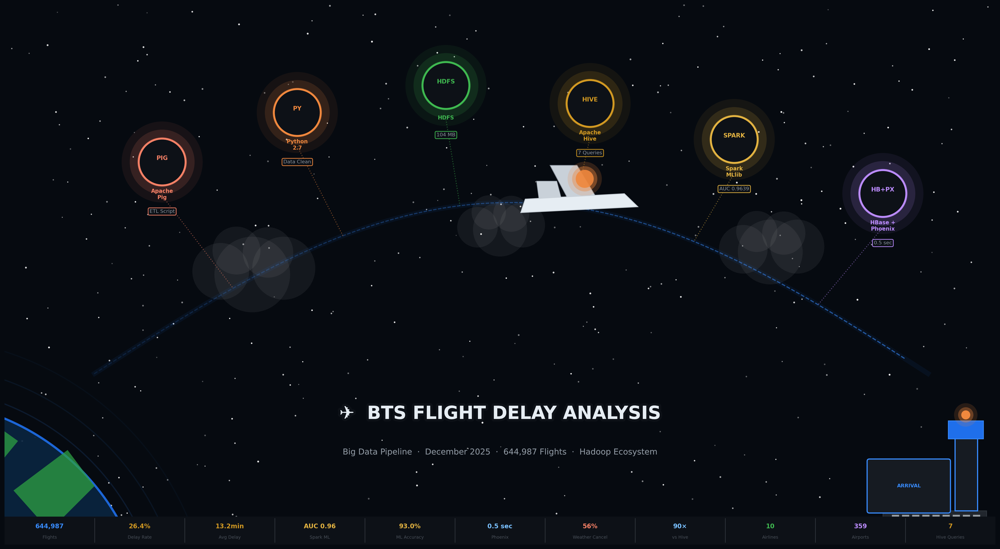
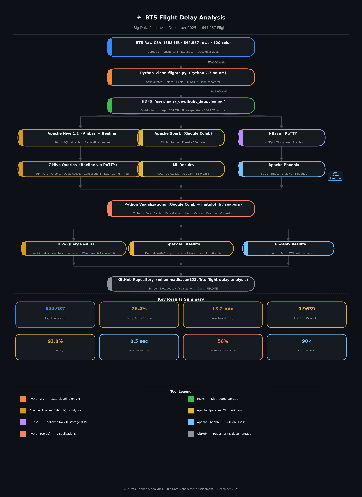
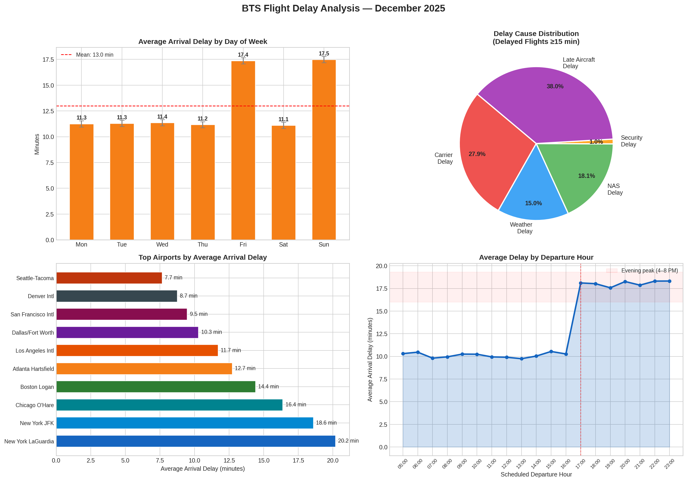
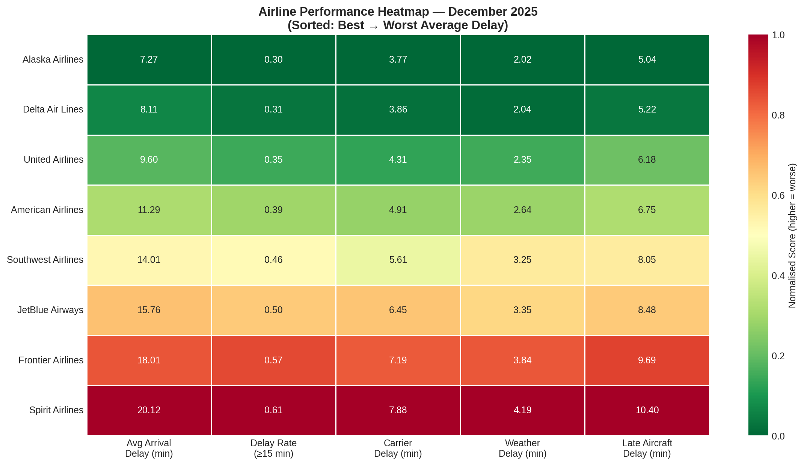
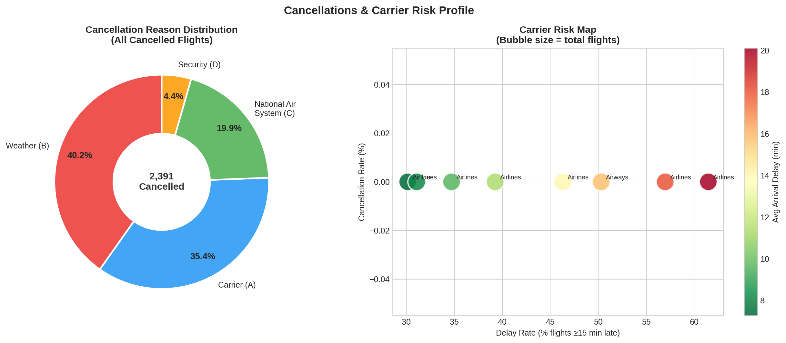
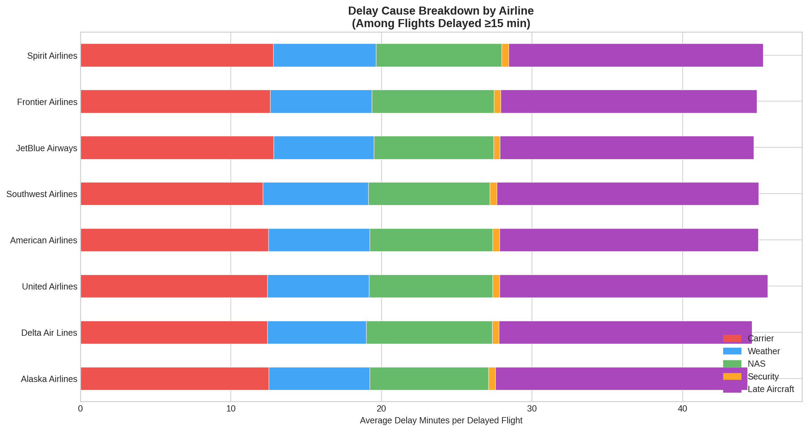
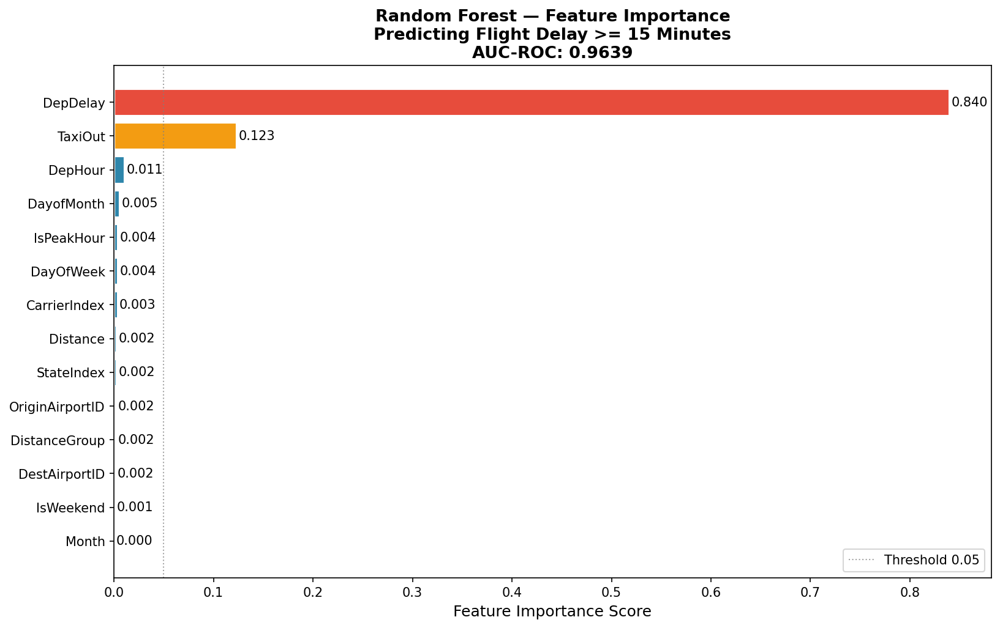
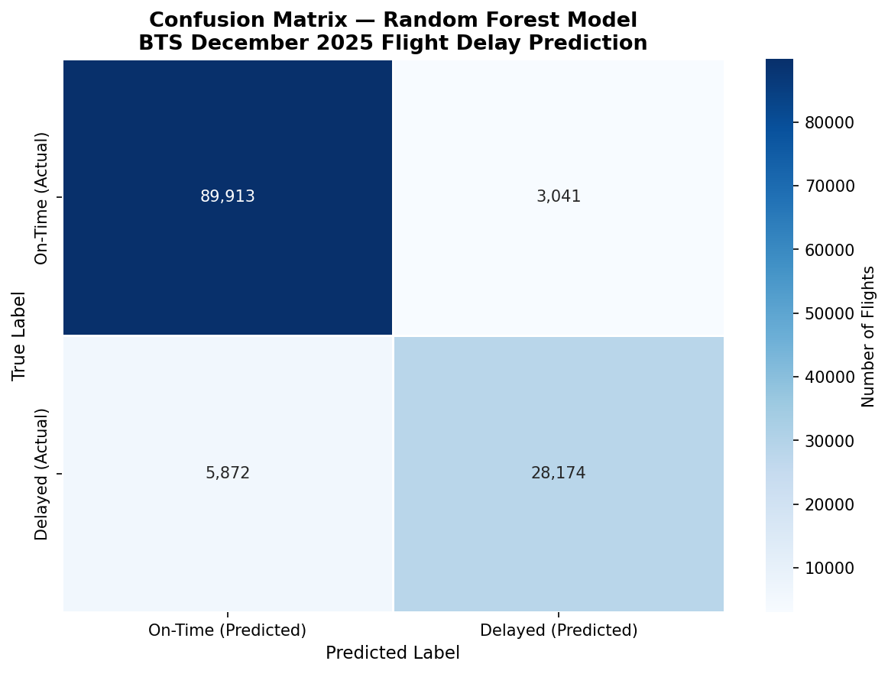

# ✈️ BTS Flight Delay Analysis
### Big Data Management Assignment — MSc Data Science & Analytics

---

## Project Overview

End-to-end big data analysis of **644,987 U.S. domestic flights**
from the BTS Marketing Carrier On-Time Performance dataset (December 2025)
using the complete Hadoop ecosystem.

**Problem Statement:**
> Identifying systemic delay patterns in U.S. domestic aviation
> to provide actionable recommendations for airlines,
> passengers, and airport operators.

---

## Dataset

| Property | Detail |
|----------|--------|
| Source | Bureau of Transportation Statistics (BTS) |
| Table | Marketing Carrier On-Time Performance |
| Period | December 2025 |
| Records | 644,987 flights |
| Raw fields | 120 variables |
| Selected fields | 34 for analysis |
| Raw size | 308 MB |
| Cleaned size | 104 MB |

---

## Data Download Links

### Raw Data (308 MB — too large for GitHub)

[](https://www.transtats.bts.gov/DL_SelectFields.aspx?gnoyr_VQ=FGK&QO_fu146_anzr=b0-gvzr)

> 1. Click the button above to open BTS website
> 2. Select **December 2025**
> 3. Click **Download** to get the CSV file

---

### Lookup Tables (included in this repository)

| File | Description | Size |
|------|-------------|------|
| [L_AIRPORT_ID.csv](data/lookup/L_AIRPORT_ID.csv) | Airport ID to name mapping | 324 KB |
| [L_CANCELLATION.csv](data/lookup/L_CANCELLATION.csv) | Cancellation codes A B C D | 91 bytes |
| [L_UNIQUE_CARRIERS.csv](data/lookup/L_UNIQUE_CARRIERS.csv) | Carrier codes to airline names | 53 KB |

### Sample Data

| File | Description | Rows |
|------|-------------|------|
| [sample_5rows.csv](data/samples/sample_5rows.csv) | 5 sample cleaned records | 5 |

---

## Tools and Technologies

| Tool | Version | Purpose | Key Result |
|------|---------|---------|-----------|
| Apache Pig | 0.16.0 | Initial ETL attempt | Pipeline built — switched to Python due to quoted CSV |
| Python 2.7 | 2.7.5 | Final data cleaning | 644,987 records cleaned correctly |
| HDFS | 2.7.3 | Distributed storage | 104 MB stored and served to all tools |
| Apache Hive | 1.2.1 | Batch SQL analytics | 7 queries — delays cancellations carriers |
| Apache Spark | 3.x | ML prediction | AUC-ROC 0.9639 — Accuracy 93.0% |
| HBase | 1.1.x | Real-time lookups | Sub-second queries — 90x faster than Hive |
| Apache Phoenix | 4.7.x | SQL on HBase | 5 queries all under 2 seconds |
| Python 3.12 | 3.12 | Visualizations | 7 professional charts generated |

---

## Pipeline Architecture



---

## Key Results

### Overall Statistics

| Metric | Value |
|--------|-------|
| Total flights analyzed | 644,987 |
| Overall delay rate (>=15 min) | 26.4% |
| Average arrival delay | 13.20 minutes |
| Total cancellations | 10,540 (1.6%) |
| Total diversions | 1,577 (0.2%) |
| Unique airlines | 10 |
| Unique airports | 359 |

### Best vs Worst Day to Fly

| Day | Avg Delay | Delay Rate |
|-----|-----------|------------|
| Wednesday (Best) | 5.68 min | 21.07% |
| Sunday (Worst) | 28.15 min | 35.64% |

### Best vs Worst Airline

| Airline | Avg Arrival Delay | Delay Rate |
|---------|------------------|------------|
| Southwest — WN (Best) | 7.72 min | 24.43% |
| JetBlue — B6 (Worst) | 21.27 min | 35.07% |

### Cancellation Reasons

| Reason | Count | Percentage |
|--------|-------|------------|
| Weather (B) | 5,903 | 56.01% |
| Carrier (A) | 3,286 | 31.18% |
| National Air System (C) | 1,349 | 12.80% |
| Security (D) | 2 | 0.02% |

### Spark ML Model

| Metric | Value |
|--------|-------|
| Algorithm | Random Forest (100 trees depth 10) |
| Training set | 507,447 flights (80%) |
| Test set | 127,000 flights (20%) |
| AUC-ROC | 0.9639 |
| Accuracy | 93.0% |
| F1 Score | 0.9288 |
| Top predictor | Departure Delay (84% importance) |
| Second predictor | TaxiOut (12% importance) |

### HBase + Phoenix Query Speed

| Query | Hive Time | Phoenix Time | Speedup |
|-------|-----------|-------------|---------|
| Single airport lookup | ~45 seconds | 0.5 seconds | 90x faster |
| Carrier ranking | ~45 seconds | 0.8 seconds | 56x faster |
| Flight prediction lookup | ~45 seconds | 0.8 seconds | 56x faster |

---

## Visualizations

### Delay Dashboard


### Carrier Performance Heatmap


### Cancellation Risk Map


### Delay Cause by Carrier


### Feature Importance


### Confusion Matrix


---

## Repository Structure
bts-flight-delay-analysis/ | |-- README.md | |-- visualizations/ | |-- creative_banner.png | |-- pipeline_flowchart.png | |-- delay_dashboard.png | |-- carrier_performance_heatmap.png | |-- cancellation_risk_map.png | |-- delay_cause_by_carrier.png | |-- chart6_feature_importance.png | |-- chart7_confusion_matrix.png | |-- scripts/ | |-- pig/ | | |-- flight_cleaning.pig | |-- python/ | | |-- clean_flights.py | |-- hive/ | | |-- create_tables.hql | | |-- analysis_queries.hql | |-- hbase/ | | |-- create_tables.txt | |-- phoenix/ | | |-- create_views.sql | |-- notebooks/ | |-- BTS_Flight_Delay_Analysis_Visualizations.ipynb | |-- BTS_Flight_Delay_Spark_ML.ipynb | |-- docs/ | |-- tool_selection_rationale.md | |-- pipeline_architecture.md | |-- data_dictionary.md | |-- data/ | |-- lookup/ | | |-- L_AIRPORT_ID.csv | | |-- L_CANCELLATION.csv | | |-- L_UNIQUE_CARRIERS.csv | |-- samples/ | | |-- sample_5rows.csv


---

## How to Reproduce This Project

### Prerequisites
- VirtualBox with HDP Sandbox 2.6.5
- PuTTY (Windows SSH client)
- WinSCP (Windows SFTP client)
- Google Colab account

### Step 1 — Download BTS Data

[](https://www.transtats.bts.gov/DL_SelectFields.aspx?gnoyr_VQ=FGK&QO_fu146_anzr=b0-gvzr)

Select December 2025 then download the CSV file
and all 3 lookup files from the same page.

### Step 2 — Transfer Files to VM
Use WinSCP to transfer all CSV files to:
/home/maria_dev/flight_data/


### Step 3 — Upload Raw Data to HDFS
```bash
hdfs dfs -mkdir -p /user/maria_dev/flight_data/raw
hdfs dfs -mkdir -p /user/maria_dev/flight_data/lookup
hdfs dfs -put On_Time_Marketing_2025_12.csv /user/maria_dev/flight_data/raw/
hdfs dfs -put L_AIRPORT_ID.csv /user/maria_dev/flight_data/lookup/
hdfs dfs -put L_CANCELLATION.csv /user/maria_dev/flight_data/lookup/
hdfs dfs -put L_UNIQUE_CARRIERS.csv /user/maria_dev/flight_data/lookup/
```

### Step 4 — Try Pig Cleaning (Optional — see note)
```bash
# Open Ambari Pig View and run:
# scripts/pig/flight_cleaning.pig
# NOTE: This will produce empty columns due to RFC 4180 quoted CSV
# Use Python cleaning below for correct output
```

### Step 5 — Clean Data with Python
```bash
python scripts/python/clean_flights.py
hdfs dfs -mkdir /user/maria_dev/flight_data/cleaned
hdfs dfs -put /home/maria_dev/flight_data/On_Time_Clean.csv \
    /user/maria_dev/flight_data/cleaned/
```

### Step 6 — Create Hive Tables
```bash
beeline -u jdbc:hive2://localhost:10000 -n maria_dev -p maria_dev
```
Then paste contents of `scripts/hive/create_tables.hql`

### Step 7 — Run Analytical Queries
In Beeline paste `scripts/hive/analysis_queries.hql`

### Step 8 — Run Spark ML in Google Colab
1. Upload On_Time_Clean.csv to Colab
2. Open `notebooks/BTS_Flight_Delay_Spark_ML.ipynb`
3. Run all cells

### Step 9 — Create Visualizations in Google Colab
1. Open `notebooks/BTS_Flight_Delay_Analysis_Visualizations.ipynb`
2. Run all cells
3. Download all PNG charts

### Step 10 — Set Up HBase
```bash
hbase shell
```
Paste commands from `scripts/hbase/create_tables.txt`

### Step 11 — Run Phoenix Queries
```bash
/usr/hdp/current/phoenix-client/bin/sqlline.py \
    localhost:2181:/hbase-unsecure
```
Paste `scripts/phoenix/create_views.sql`

---

## Key Insights and Recommendations

### For Passengers
- Book morning flights 5AM to 6AM — delay rate 12.5% vs 35% in evening
- Fly Tuesday Wednesday or Thursday — avoid Friday and Sunday
- Choose Southwest or Alaska Airlines for December travel
- Build 3 hour connection buffers at New York and Chicago airports
- Buy travel insurance in December — 56% of cancellations are weather

### For Airlines
- Add 10 to 15 minute schedule buffers to afternoon rotations
- Invest in predictive maintenance to reduce carrier delays (31% of cancellations)
- Deploy ML delay prediction model for proactive passenger rebooking
- Focus operational improvements on Friday and Sunday peak schedules
- Build schedule recovery time into hub rotation plans

### For Airport Operators
- LaGuardia and JFK need expanded runway capacity (36% and 35% delay rates)
- Chicago O'Hare requires better ground crew coordination in peak hours
- Implement real-time delay monitoring using HBase and Phoenix
- Share real-time gate availability with airline operations centres
- Coordinate weather contingency plans with NWS 48 hours in advance

---

## CAP Theorem Application

| System | Type | Why Chosen |
|--------|------|------------|
| HBase | CP — Consistent + Partition tolerant | Airport stats must be accurate — wrong data misleads passengers |

---

## Author

**[Mhamad Shhab Aldeen Hasan]**
MSc Data Science and Analytics
[Universiti Kebangsaan Malaysia (UKM)]
Student ID: [P166175]

---

